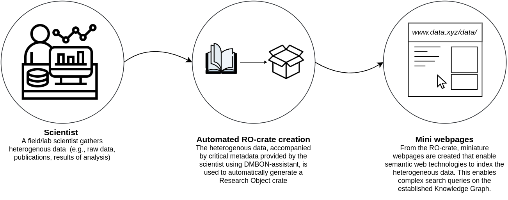

<!--
    This file is intended to provide useful start-page content - as all README.md files should provide!
-->

[](https://github.com/vliz-be-opsci/dmbon-assistant/actions/workflows/buld_test_and_auto_tag_release.yml)

:earth_africa: **[Learn more about DMBON assistant on our website](https://open-science.vliz.be/#projects)**

# Data management assistant
Data management assistant for Biodiversity Observation Networks (DMBON-assistant) is a case study of a more general data management framework and webtop application that supports scientists by providing a consistent and streamlined dataflow within and between individuals and organizations. 
It lowers the barrier for collaborative efforts by making data more accessible and searchable, enabling more complex search queries on open datasets that enrich meta-analyses.
The DMBON-assistant is an important piece of our grander [vision](#our-vision).

[//]: <> (CLEARLY EXPLAIN WHO THIS PROJECT IS FOR)
#### Who is it for?
This project is intended for academics, policy makers, and the general public. 
Academics are encouraged to share their research in a way that makes their research more meaningful and easily citable.
Policy makers benefit from this tool through lowering the barrier for extensive meta-analysis that can shed light on previously unreported correlations.
Finally, the general public benefits from such an open source tool by making academic research more easily accesible to the public.
We believe that open sourcing a project such as this benefits the community and with it we hope to advocate for future open science policies to come.

[//]: <> (EXPLAIN HOW TO READ THIS DOCUMENT)
##### Reading this README
In this README, we will explain our vision for this project. 
We will further motivate our choices and provide users and developers on how to use and contribute to DMBON-assistant. 

### Table of contents
- [Our vision](#our-vision)
  - [Motivation](#motivation)
    - [Metadata: the overlooked critical component](#metadata-the-overlooked-critical-component)
    - [Why open source?](#why-open-source)
- [How does it work?](#how-does-it-work)
- [Getting started](#getting-started)
- [Installation](#installation)
  - [On Windows](#on-windows)
  - [On Linux](#on-linus)
  - [On Mac OS](#on-mac-os)
  - [Getting started](#getting-started)
- [Contributing](#contributing)

---
[//]: <> (VISION)
## Our vision
We believe that discovery relies on open and transparent management of data - following the [FAIR principles](https://www.go-fair.org/fair-principles/).
We furthermore believe that researchers should be able to search through scientific data as if they are searching the semantic web.
This means that search queries such as *"what was the water temperature during recent sightings of killer whales in the North Pacific Ocean?"*, should be made possible. 
Obviously, for scientific data to be FAIR and meaningful to allow such queries, it has to adhere to specific rules such that others can discover, filter and (re-)use the data with little effort.
Ideally, tools should exist such that those that gather data should be able to upload meaningful data with relative ease. \
This project aims to do exactly that: assist people in uploading their data (including metadata) to the web.

**Goals**: \
:heavy_check_mark: Introduce a simple assisted procedure for uploading heterogeneous data that conforms to FAIR data management plans. \
:heavy_check_mark: Enable complex search queries for meta-analysis on heterogeneous data. \
:heavy_check_mark: Build a thriving community that supports open science.



### Motivation
Sound scientific results are derived from good data. 
While few people disagree with this statement, the current methods of both storing and accessing historical data are severely hampering novel scientific discoveries. 
On one end, data of published studies are permanently lost (Vines et al., [2014](https://doi.org/10.1016/j.cub.2013.11.014)) or researchers forget the details requires to make use of the data (Whitlock et al. [2010](https://doi.org/10.1086/650340)).
On the other end, losing access to data (and, importantly, their [metadata](#metadata)) makes it impossible to reproduce scientific results or perform critical meta-analyses.
Therefore, automated streamlining of data management plans (DMPs) is necessary for improving data preservation and accesibility.
DMBON-assistant is an open source webtop application designed to provide this automisation, thereby enabling consistent and streamlined data management.

##### Metadata: the overlooked critical component
One critical, but often overlooked, feature that greatly increases the longevity of datasets is [metadata](https://en.wikipedia.org/wiki/Metadata) (Leipzig et al. [2021](https://doi.org/10.1016/j.patter.2021.100322)), i.e. 'data that provides information about other data'. 
Metadata often encodes how to interpret the actual data, e.g. descriptions of meaning of columns in a table, and is thus often necessary for meta-analyses.
While sharing primary data is becoming increasingly more common (even though the process is not streamlined, see, e.g. Alsheikh-Ali et al., [2011](https://doi.org/10.1371/journal.pone.0024357) and Baker, [2015](https://doi.org/10.1038/533452a)), extensive efforts are often needed to gain access to metadata even when data is openly available (Tedersoo et al., [2021](https://doi.org/10.1038/s41597-021-00981-0)).
DMBON-assistant aims to alleviate this issue by assisting its users in providing the sufficient metadata that is needed to correctly interpret the data.

##### Why open source?
We are a small team and can only do so much.
Furthermore, we also cannot discover and fix all bugs and we can never cover all potential use cases and develop features for them. 
We are additionally huge advocates for open science and thus open source projects, such as this one. 
Therefore, we lay our hopes and trust with you, the community, to improve and further extend DMBON-assistant's functionality.
We welcome any and all suggestions, feedback, bug reports and general discussion on DMBON-assistant. \
If you are interested, please find the section on [contributing](#contributing) below!

---
[//]: <> (PROVIDE A GENERAL OVERVIEW OF HOW THE TOOL FUNCTION)
## How does it work?
Interested? Great! 
But how does DMBON-assistant actually help those that gather data to upload and uplift their data in a meaningful way?


Explain the general premise of DMBON-assistant

- greatly simplifies generation of FAIR research objects 
- ensures correspondence with established data management plans
- ensures fast and easy indexation and discovery of research objects through automatic semantic uplifting

[//]: <> (GETTING STARTED)
## Getting started
### Installation
<h4>
  
  
  On Windows
</h4>
(Thorough Windows installation instructions)
<h4>
  
  
  On Linux
</h4>
(Thorough Linux system installation instructions)
<h4>
  
  
  On Mac OS
</h4>
(Thorough MacOS system installation instructions?)

### Example usage
How to quickly get started using DMBon-assistant, using a very simple usecase.

#### General usage
Explain the general workflow that users should adhere to

### Best practices
Highlight best practices (i.e. **DO**s & **DONT**s). Do not be too restrictive!

[//]: <> (HOW TO CONTRIBUTE)
## Contributing
Please find our [CONTRIBUTION guidelines](CONTRIBUTING.md) for more details on the process of contributing.


<!--
# dmbon-assistant
webtop appliction consisting of a backend powered by fast-api and a react frontend

## for people without docker:

### for windows users (linux users can skip this step)
Install git and git bash following the steps of this link
 [ git-bash installation ](https://www.stanleyulili.com/git/how-to-install-git-bash-on-windows/)

run following commands in terminal of the root project directory:
```
sh ./dmbon-assistant start
```

## for people with docker (not yet implemented):
run following commands in terminal of the root project directory:
#TODO have a docker solution. 
```
sudo docker-compose up
```

## Updating tags

This repo also has automated versioning and latest release management.
When pushing a change , the user can add the following tags to the commit header to trigger a new release of the repo. (#major , #minor , #patch, #none)
[more info on repo relase tags here](https://github.com/marketplace/actions/github-tag-bump)

When using the #major appendix in the commit header, the repo will push out a release.
By default a push to this repo will result in a new patch tag eg: Vx.x.x+1

The following code coming from the /github/workflow/testing.yml shows how this works:

```  
name: On_Push_Testing

on:
  push:
    branches: [ main ]
  pull_request:
    branches: [ main ]

jobs:

  test_build:

    runs-on: ubuntu-latest

    steps:
    - uses: actions/checkout@v3
    - name: Bump version and push tag
      uses: anothrNick/github-tag-action@1.36.0
      env:
        GITHUB_TOKEN: ${{ secrets.GITHUB_TOKEN }}
        WITH_V: true
        DEFAULT_BUMP: patch
    - name: change latest tag
      uses: EndBug/latest-tag@latest
      env:
       GITHUB_TOKEN: ${{ secrets.GITHUB_TOKEN }}
       token: ${{ secrets.GITHUB_TOKEN }}
      with:
        # You can change the name of the tag or branch with this input.
        # Default: 'latest'
        ref: 'latest'
        # If a description is provided, the action will use it to create an annotated tag. If none is given, the action will create a lightweight tag.
        # Default: ''
        description: 'latest version of the rocrate-to-html.' 
        # Force-update a branch instead of using a tag.
        # Default: false
        force-branch: false
          
  release-manager:
    needs: test_build 
    name: Check if ready for release
    runs-on: ubuntu-latest
    env:
      GITHUB_TOKEN: ${{ secrets.GITHUB_TOKEN }}
    steps:
      - run: echo ${{ github.event.repository.name }}
        name: Get latest tag of repo 
      - uses: oprypin/find-latest-tag@v1
        with:
          repository: vliz-be-opsci/${{ github.event.repository.name }}  # The repository to scan. Change the part before the / to name or organisation where repo resides
          releases-only: false  # Set to true if you want to know the tag linked to the latest release
        id: vliz-be-opsci  # The step ID to refer to later.

      - run: echo "${{ github.event.repository.name }} is at version ${{ steps.vliz-be-opsci.outputs.tag }}"
        name: check if latest tag meets maor release requirements
      - uses: actions-ecosystem/action-regex-match@v2
        id: regex-match
        with:
          text: ${{ steps.vliz-be-opsci.outputs.tag }}
          regex: 'v[0-9].0.0'
      - name: Create release
        if: ${{ steps.regex-match.outputs.match != '' }}
        uses: rymndhng/release-on-push-action@master
        with:
          bump_version_scheme: mayor
```
-->
